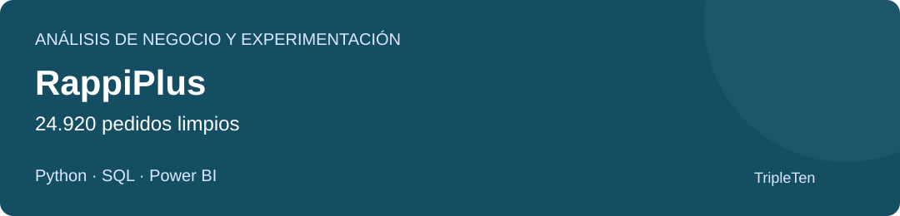

# José Luis Monsálvez | Data Analyst y Business Intelligence

**SQL · Python · Power BI · Excel | Administración, costes y operaciones**

Conecto mi experiencia en administración, operaciones y formación de equipos con el análisis de datos para apoyar decisiones de negocio. Completé el Bootcamp de Data Analytics de TripleTen.

## Encuentra un proyecto según lo que quieras evaluar

| Interés | Proyecto recomendado | Evidencia principal |
| --- | --- | --- |
| Análisis de principio a fin y decisiones de negocio | [RappiPlus](#rappiplus) | Python, SQL, experimentación y Power BI |
| Modelado e indicadores comerciales | [Andes Capital](#andes-capital) | Power BI y datos de ventas |
| Exploración y comportamiento de clientes | [NovaRetail](#novaretail) | Notebook, visualizaciones y dataset |
| Excel e indicadores de ventas | [Walmart](proyecto-walmart/README.md) | Libro con selector de departamento |

[Todos los proyectos](PROYECTOS.md) · [Archivos y revisiones pendientes](ESTADO_PROYECTOS.md)

## Proyectos destacados

### RappiPlus

**Problema:** ¿Qué muestran los costes, la conversión y la retención, y hay evidencia para cambiar el checkout?

**Datos y análisis:** Pedidos de enero a junio de 2025, catálogo, marketing, tablas SQL y un A/B con 10.000 usuarios. Limpieza e integración con Python, consultas SQL, indicadores económicos y prueba de dos proporciones.

**Hallazgo:** El A/B no demuestra una mejora de conversión (p = 0,4161). El resultado económico considera productos y marketing, no todos los gastos del negocio.

**Entrega:** Notebook, siete consultas SQL, tres CSV e informe Power BI de cuatro páginas.

[Leer el caso](proyecto-rappiplus/README.md) · [Abrir archivos](proyecto-rappiplus/) · [Descargar Power BI](https://raw.githubusercontent.com/JoseLuisMonsalvez/tripleten-data-projects/main/proyecto-rappiplus/dashboard/RappiPlus.pbix)

### Andes Capital

**Problema:** ¿Qué propiedades aportan ingresos y cómo evoluciona la actividad comercial?

**Datos y análisis:** 8.500 ventas, 3.500 clientes y 8.000 propiedades en tablas de hechos y dimensiones. Modelado y cuatro vistas de Power BI: ejecutiva, comercial, estacional y cohortes.

**Hallazgo:** Las casas aportan el 37,26 % de los ingresos y los departamentos el 60,06 % de las operaciones: volumen y valor orientan prioridades distintas.

**Entrega:** PBIX, memoria del análisis y tres CSV. Indicadores principales contrastados con los datos.

[Leer el caso](proyecto-andes-capital/README.md) · [Abrir archivos](proyecto-andes-capital/) · [Descargar Power BI](https://raw.githubusercontent.com/JoseLuisMonsalvez/tripleten-data-projects/main/proyecto-andes-capital/dashboard/Andes_Capital.pbix)

### NovaRetail

**Problema:** ¿Cómo se relacionan compras, publicidad y visitas con el comportamiento de los clientes?

**Datos y análisis:** Dataset de NovaRetail de 2024 con 15.000 registros y 12 variables. Exploración, visualizaciones, Pearson, Spearman y medidas de asociación para variables binarias y categóricas.

**Hallazgo:** Compras e ingresos presentan una asociación fuerte (Pearson 0,967). Publicidad y visitas muestran una asociación moderada (0,579); las relaciones no prueban causalidad.

**Entrega:** Notebook con resultados guardados, dataset y dependencias. Gráficos originales disponibles.

[Leer el caso](proyecto-novaretail/README.md) · [Abrir archivos](proyecto-novaretail/) · [Ver notebook](proyecto-novaretail/NovaRetail.ipynb)

## Cómo consultar el portafolio

- **En GitHub:** lee las fichas, notebooks y consultas. Las fichas explican el problema, los datos, mi contribución, los hallazgos y sus límites.
- **En Power BI Desktop:** descarga el PBIX para explorar el informe y sus filtros. GitHub guarda el archivo, pero no muestra una vista previa interactiva. La actualización puede requerir adaptar las rutas de los CSV incluidos.
- **En Excel:** descarga el libro antes de abrirlo. Walmart conserva las cifras entregadas a TripleTen y permite seleccionar departamentos en el dashboard.

Son proyectos formativos. Las recomendaciones se presentan como propuestas del análisis, sin atribuirles mejoras implementadas en empresas reales. Cada ficha detalla qué comprobaciones se hicieron y qué fuentes faltan para repetir el trabajo.

La carpeta [docs](docs/) contiene una portada web con filtros por herramienta y enlaces a estos casos. Se puede abrir descargando `docs/` y abriendo `index.html`; su publicación con GitHub Pages se explica en [docs/README.md](docs/README.md).

## Contacto

[LinkedIn](https://www.linkedin.com/in/jos%C3%A9-luis-mons%C3%A1lvez/) · [GitHub](https://github.com/JoseLuisMonsalvez)

[Archivos complementarios en Google Drive](https://drive.google.com/drive/folders/14Evzp1zViYQDDV19x8JgouYZs4Y65TUm?usp=sharing)
