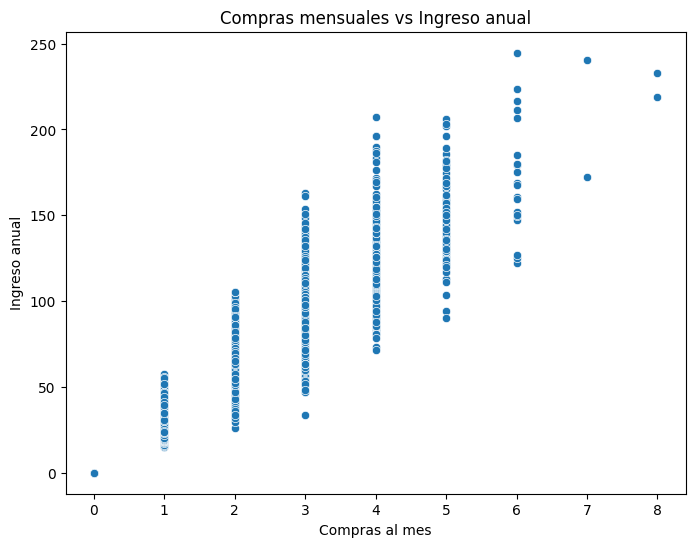

# NovaRetail — Correlaciones y comportamiento de clientes

[Inicio del portafolio](../README.md) · [Todos los proyectos](../PROYECTOS.md)

## El caso en un minuto

**Pregunta de negocio:** ¿Cómo se relacionan compras, publicidad y visitas con el comportamiento de los clientes?

**Conclusión principal:** Compras e ingresos presentan una asociación fuerte (Pearson 0,967). Publicidad y visitas muestran una asociación moderada (0,579); las relaciones no prueban causalidad.

**Evidencia:** Notebook con resultados guardados, dataset y dependencias. Gráficos originales disponibles.

### Visualización del análisis original

Gráfico extraído de la salida guardada del notebook entregado. La asociación observada no demuestra causalidad.

Proyecto formativo de José Luis Monsálvez, Sprint 8 del Bootcamp Data Analytics de TripleTen.

## Mi contribución y decisiones

Revisé los datos, preparé visualizaciones, calculé correlaciones y medidas de asociación y redacté su interpretación para el negocio.

Comparé Pearson y Spearman para las relaciones numéricas y utilicé métodos específicos para variables binarias y categóricas. Separé asociación de causalidad y propuse pruebas A/B como siguiente paso para validar acciones de marketing. Esta versión conserva el análisis revisado y adapta la lectura al CSV disponible.

## Problema de negocio

Identificar relaciones entre comportamiento de compra, ingresos generados por clientes, publicidad, visitas y variables de segmentación, para orientar hipótesis de marketing y fidelización.

## Datos y herramientas

15.000 registros y 12 variables del caso NovaRetail de 2024. Incluye compras y visitas mensuales, publicidad dirigida, satisfacción, membresía premium, abandono, dispositivo y región. Python, Pandas, NumPy, Matplotlib, Seaborn y SciPy.

El CSV suministrado por el autor está en [data/](data/novaretail_comportamiento_clientes_2024.csv) y utiliza punto y coma como separador. No se ha sustituido por un dataset externo.

## Análisis y hallazgos

- Revisión de tipos, distribuciones y categorías; matriz de correlación y gráficos de dispersión.
- Compras mensuales e ingreso anual: Pearson **0,967** y Spearman **0,967** en los resultados guardados.
- Publicidad dirigida y visitas: Pearson **0,579** y Spearman **0,559**.
- Se aplicaron correlaciones punto-biseriales a variables binarias y V de Cramér a región y dispositivo.
- Región y dispositivo: V de Cramér cercano a **0,012**, p = **0,596**; no se observó una asociación relevante en el caso.

Las relaciones son asociaciones: no demuestran que publicidad o membresía causen un incremento de visitas o ingresos. Se propone validar las hipótesis con experimentos y ampliar la segmentación.

## Resultado y ejecución

[Notebook](NovaRetail.ipynb) con tablas, tres gráficos guardados, interpretación y limitaciones. Se tomó la versión «REVISIÓN» y se conservaron los cálculos y salidas del autor; los comentarios del evaluador permanecen en la fuente local. Se adaptó la carga al CSV incluido y se hizo explícita la selección numérica de la matriz de correlación para compatibilidad con Pandas.

Instala `pip install -r requirements.txt`, inicia Jupyter desde esta carpeta y ejecuta el notebook en orden. Puedes consultar sus resultados guardados sin instalar dependencias.

**Verificación:** el CSV tiene 15.000 filas, sin nulos ni duplicados exactos; las dos correlaciones de Pearson se recalcularon y coinciden con las guardadas. Se revisó la sintaxis del código. No se ejecutó todo el notebook en el entorno de preparación, que carece de SciPy, Matplotlib, Seaborn y Jupyter; los resultados de esos métodos se atribuyen a las salidas del autor.
